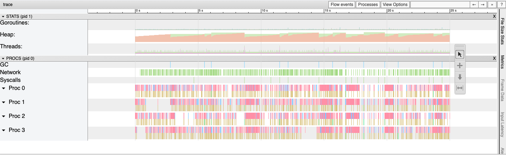

go-worker
==========
Go Worker for spawning workers to achieve parallel processing

## Description
This application is responsible for pulling billing events from SQS and processing them in real time. Once the event is read, billing info is passed to an external API and the cost for call from API response is updated in the database

## Setup
### Local
1. Clone the repository under GOPATH
2. Install dependencies using ```go mod download```
3. Update the config in ```config/config.toml```
4. Run the application using ```go run main.go -e DEV```
5. Stop the application by pressing CTRL+C which internally closes all the workers gracefully
### Docker
Docker compose internally runs the linter, tests before building the application. If there is any error with linter or tests, build will be failed. Run docker compose using 

```docker-compose up --build```
### Run Linter
```golangci-lint run -v -c golangci.yml```
### Run Tests
```go test ./... -cover```
### Pprof
This application internally have pprof API's registered. Following is an example of trace profiling using pprof API's



For generating a new trace profile, use ```curl -o trace.out "http://localhost:6000/debug/pprof/trace?seconds=25``` and change "seconds" query parameter as required.
